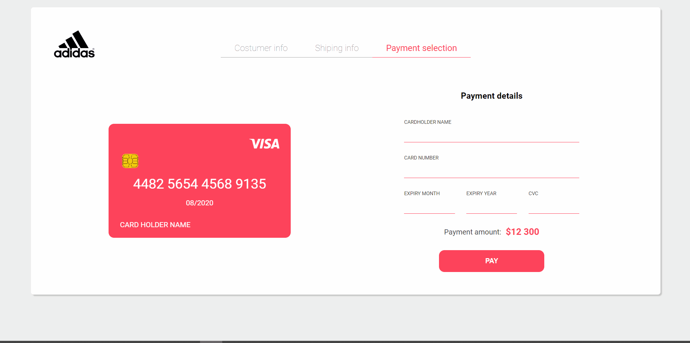

# Credit Card Form

Form design I found on Dribbble used to practice my CSS skills. Design used for reference credited at the bottom.

## Tech Stack

HTML, SASS and JavaScript.

## Live Demo

https://pedroenriquedev.github.io/CreditCardForm/

#### Showcase

## Installation

Simply clone the repo and run the html file on the browser. If you wish to make any changes to the scss file, install a SASS compiler on the code editor of your preference.

## Credits

Arina - https://dribbble.com/shots/5670746-Credit-Card-Checkout-Daily-ui-02.

## Support

For support, please email pedroenriquedev@gmail.com.
